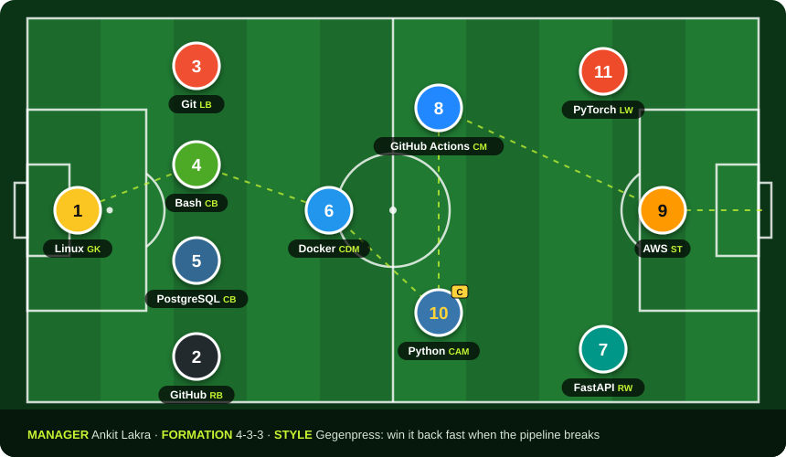

<!-- ═══════════════════════ KICK-OFF ═══════════════════════ -->
<p align="center">
  
</p>

<p align="center">
  <a href="https://git.io/typing-svg">
    
  </a>
</p>

<p align="center">
  <a href="https://www.linkedin.com/in/ankit-lakra"></a>
  <a href="mailto:ankitlakarhara@gmail.com"></a>
  <a href="https://hub.docker.com/u/ankit7777"></a>
  
</p>

---

## 📋 Player Profile

```yaml
player:          Ankit Lakra
nationality:     India 🇮🇳
home_ground:     Mangaluru
academy:         B.E. CSE (AI & ML) — MITE, Mangaluru
loan_spell:      AI & Data Science Intern @ Kakunje Software (Feb–May 2026)
position:        Box-to-box engineer — Cloud · DevOps · MLOps · Agentic AI
playing_style:   Gegenpress — win the ball back fast when a pipeline breaks
this_season:
  - building a production-grade e-commerce platform on AWS (FastAPI + Postgres)
  - preparing for AWS Certified Cloud Practitioner
  - leveling up in Linux internals & OverTheWire Bandit
transfer_status: Open to entry-level Cloud / DevOps / SRE / MLOps roles — remote or relocation ✅
fun_fact:        I trust a green CI pipeline more than my own code 😄
```

---

## 🏟️ The Squad — Starting XI

<p align="center">
  
</p>

<p align="center"><b>🪑 On the Bench</b></p>
<p align="center">
  
</p>
<p align="center">
  
</p>
<p align="center">
  
  
  
  
  
</p>

<p align="center"><b>🔭 Transfer Targets (learning next) →</b>
  
  
  
  
  
</p>

---

## 🏆 Trophy Cabinet & Fixtures

<table>
<tr>
<td width="50%" valign="top">

### 🏆 FastAPI CI/CD Pipeline <sub>full-time ✅</sub>
FastAPI service with a full CI/CD flow — **ruff** linting, **pytest** tests, Dockerized, and auto-published to **Docker Hub** via GitHub Actions.

`FastAPI` `Docker` `GitHub Actions` `pytest`

[](https://github.com/AnKIT7-ops/fastapi-ci-demo)

</td>
<td width="50%" valign="top">

### ⚽ E-Commerce Platform on AWS <sub>🟢 in play</sub>
Multi-service FastAPI + Postgres backend — the foundation for Terraform, Kubernetes, and observability layers.

`FastAPI` `PostgreSQL` `AWS` `Docker`


</td>
</tr>
<tr>
<td width="50%" valign="top">

### 📅 ML Model Monitoring & Drift Detection <sub>next fixture</sub>
Real-time drift detection for deployed models with automated alerting and dashboards — VAR for your models.

`Evidently AI` `Airflow` `Prometheus` `Grafana`

</td>
<td width="50%" valign="top">

### 📅 Self-Healing Agentic MLOps Assistant <sub>next fixture</sub>
An AI agent that watches ML pipelines, diagnoses failures, and triggers fixes on its own — a manager who never leaves the touchline.

`LangGraph` `CrewAI` `Python` `Docker`

</td>
</tr>
</table>

---

## 🗓️ Season Fixtures

```mermaid
flowchart LR
    A["MD1 · 🐧 Linux & Git"] --> B["MD2 · 🐳 Docker + CI/CD"]
    B --> C["MD3 · ☁️ AWS"]
    C --> D["MD4 · ⎈ Kubernetes + Terraform"]
    D --> E["MD5 · 📡 Observability"]
    E --> F["SEMI · 🧠 MLOps"]
    F --> G["🏆 FINAL · 🤖 Agentic AI Systems"]
    style A fill:#1c6b2c,color:#fff
    style B fill:#1c6b2c,color:#fff
    style C fill:#C6F432,color:#000
    style D fill:#1e1e2e,color:#fff
    style E fill:#1e1e2e,color:#fff
    style F fill:#1e1e2e,color:#fff
    style G fill:#1e1e2e,color:#FFD43B
```


<sub>🟩 won &nbsp;·&nbsp; 🟨 in play &nbsp;·&nbsp; ⬛ upcoming</sub>

---

## 📊 Match Day Stats

<p align="center">
  
</p>
<p align="center"><sub>Goals = contributions · Shots on target = commits · Assists = PRs · Unbeaten run = contribution streak · refreshed every 12 hours</sub></p>

---

## ⚽ Dribbling Through My Contributions

<p align="center">
  <picture>
    <source media="(prefers-color-scheme: dark)" srcset="https://raw.githubusercontent.com/AnKIT7-ops/AnKIT7-ops/output/github-snake-dark.svg"/>
    <source media="(prefers-color-scheme: light)" srcset="https://raw.githubusercontent.com/AnKIT7-ops/AnKIT7-ops/output/github-snake.svg"/>
    
  </picture>
</p>

---

<p align="center">
  <i>"It works on my machine" → "It works in every container." 🐳 &nbsp;|&nbsp; Full-time. 🏁</i>
</p>

<p align="center">
  
</p>
